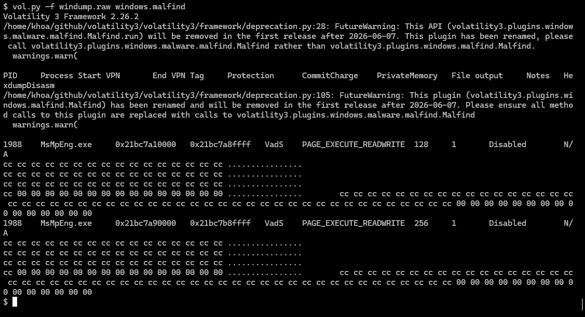

# {{ title }}

Don't want to use online malware sanboxes or want to create/experiment with your own? Here's a simple system (a set of scripts) for automating dynamic malware analysis that I came up with.  
If there are any suggestions/improvements please write to my email.

## The Setup

The VM OS is Windows 10 run with Qemu with KVM enabled.  
Process in order: put malware into share folder, revert back to snapshot, get file list, start VM, execute, dump memory/network, shutdown, get file list after. The image is left in the infected state. 

## Some Limitations

This setup doesn't address network simulation (via inetsim,...) yet. During my testing I also found out that QMP protocol's dump-guest-memory was not able to extract all the registry hives. A simple work around was to copy Hives manually while SSH'd into the VM.

### Transferring Malware / Remote Access

We will be using Qemu's Samba server while in user networking mode. Just add "smb=" in "-netdev" options.  
An SSH server will be used for remote access, we must forward the port 22 from Windows to our host machine.

### Running Malware

For this demonstration, I will be only analyzing Windows executables.   
Tutorial on installing Windows to a disk image using Qemu will be made __later__.  
[Heredoc](https://en.wikipedia.org/wiki/Here_document) is very helpful for scripting in SSH connections. In my demonstration I will be using heredoc scripts to take registry snapshots, running malware, copying logs to output... Reverting back to snapshot is optional here in case we need the infected image for more static analysis.

### Collected Information

Registry, Reigstry changes, Windows Log (Sysmon primarily) will be done through Windows pre-installed programs and SSH scripting.  
System RAM/memory dump will be retrieved using the QMP's dump-guest-memory mentioned above.  
For network traffic I will use "filter-dump" object from Qemu builtin options.  
For comparing system files, before and after executing malware, I found a way to read/get a list of file names from image using guestfish.  

## Demonstration

### Using The System to Analyze RedLineStealer

For this part I'll give some demonstration pictures using the system.  
Got the sample from [here](https://bazaar.abuse.ch/sample/67559021bb3b13bef30226a052dd097156aa998543f4a3689649f4e00de86686/).  
All of the scripts I will probably put on Github and link it __here__.  
Here's the file structure, scripts names:  
```bash
├── analyze.sh      # master script
├── clear_output.sh
├── get_fs_list.sh  # get files list
├── qmp_dump_mem.py
├── qmp_shutdown.py # not really needed, just kill process
├── run_qemu.sh     # to start the VM
├── img 
│   └── base_img.qcow2  # the VM image in qcow2 format
├── iso             # isos used for installing vm
├── output          # final output
├── share
│   ├── malware     # put the malware to analyze here
│   └── output      # will be written to after malware execution
└── venv_qemu       # python venv for qmp lib
```
Let's start.  
Put the malware into SMB share folder.  
  
Here's me starting the process, it is always interesting to see what malware outputs into the command line if there are any.  
  
  
It's seems that the malware logged some error on to the commandline which could indicate that it won't run :(.  
Here are the output files.  
  
Getting diff between files list didn't return anything suspect this is the full output, malware doesn't delete it self by default.  
```bash
ProgramData/Microsoft/Search/Data/Applications/Windows/GatherLogs/SystemIndex/SystemIndex.5.Crwl
ProgramData/Microsoft/Search/Data/Applications/Windows/GatherLogs/SystemIndex/SystemIndex.5.gthr
Recovery/OEM
Recovery/OEM/AfterImageApply_BDB0C1E8-6951-46C4-AB7F-C07B29F462FD.cmd
Recovery/OEM/ResetConfig.xml
Users/User/Downloads/67559021bb3b13bef30226a052dd097156aa998543f4a3689649f4e00de86686.exe
Users/User/reg_diff.txt
Users/User/snaps
Users/User/snaps/BCD00000000
Users/User/snaps/Default
Users/User/snaps/SAM
Users/User/snaps/Software
Users/User/snaps/System
Users/User/snaps/UsrClass.dat
Users/User/snaps/ntuser.dat
Windows/Logs/waasmedic/waasmedic.20250724_120459_009.etl
Windows/Prefetch/67559021BB3B13BEF30226A052DD0-1025AE0F.pf
Windows/Prefetch/UPFC.EXE-BDDF79D6.pf
Windows/Prefetch/WAASMEDICAGENT.EXE-ED0D7511.pf
Windows/ServiceProfiles/LocalService/AppData/Local/FontCache/~FontCache-FontSet-S-1-5-18.dat
Windows/ServiceProfiles/LocalService/AppData/Local/FontCache/~FontCache-S-1-5-18.dat
Windows/System32/WDI/{533a67eb-9fb5-473d-b884-958cf4b9c4a3}/{7f3e4299-bc0e-4d37-81e8-3da205d0aca5}
Windows/System32/WDI/{533a67eb-9fb5-473d-b884-958cf4b9c4a3}/{7f3e4299-bc0e-4d37-81e8-3da205d0aca5}/snapshot.etl
Windows/System32/sru/SRU00058.log
Windows/System32/sru/SRU00059.log
Windows/System32/sru/SRU0005A.log
Windows/System32/sru/SRU0005B.log
Windows/System32/sru/SRU0005C.log
Windows/System32/sru/SRU0005D.log
Windows/System32/sru/SRU0005E.log
Windows/System32/sru/SRU0005F.log
```
Let's look into the net dump next. I will be using Wireshark.  
We want to filter for packets from VM to the Qemu internal router, though it seems no interesting requests were recorded.  
  
No interesting output from memory neither.  
  

## Conclusion

Well that was kind of a failure... Though I'm sure it would work for some other malware, this system is still very experimental/lack of testing. Online malware sandboxes are much more efficient and effective but I just made this in my free time out of curiosity.

<small>note: first post ever please mind my mistakes<small>
